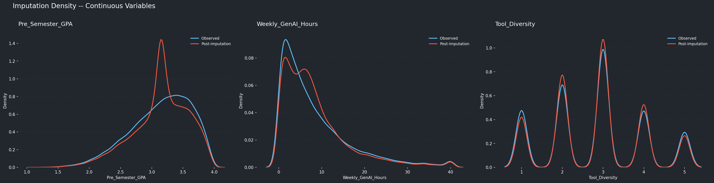
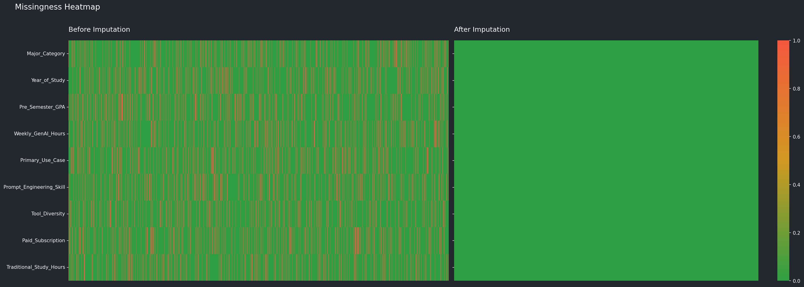
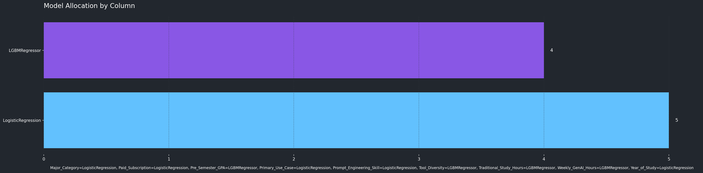

# Smart Imputation

**Simpute** is an adaptive missing-value imputation library for tabular data. Instead of applying one global strategy to every column, it profiles each feature, selects a tailored model, and imputes columns sequentially so earlier fills inform later ones.

Install from PyPI as `simpute`. Source and releases live at [github.com/Hvllvix/Simpute](https://github.com/Hvllvix/Simpute).

---

## Why Simpute

Most imputers pick a single method (mean, median, MICE, KNN) for the whole table. Real datasets mix binary flags, low-cardinality categories, high-cardinality text-like fields, skewed counts, and smooth continuous variables. Simpute treats each column on its own terms.

| Approach | Simpute |
|----------|---------|
| Strategy | Per-column profiling and model routing |
| API | Scikit-learn `fit` / `transform` / `fit_transform` |
| Models | LightGBM, CatBoost, logistic/SVM, KNN, Bayesian Ridge, Extra Trees |
| Safety | Guard test suite with ground-truth verification |
| Warnings | Flags columns above 70% missingness |

---

## Installation

```bash
pip install simpute
```

Development install with tests and plotting extras:

```bash
git clone https://github.com/Hvllvix/Simpute.git
cd Simpute
pip install -e ".[dev]"
```

---

## Quick Start

```python
import pandas as pd
from simpute import Simpute

df = pd.read_csv("data.csv")

imputer = Simpute(exclude=["Student_ID"])
filled = imputer.fit_transform(df)

print(imputer.getmodelselection())
print(imputer.getprofiles())
```

`exclude` keeps identifier columns out of the imputation loop. Use `columns=[...]` instead when you only want to impute a subset.

---

## How It Works

1. **Profile** each target column (type, missingness, cardinality, distribution shape).
2. **Select features** with mutual information (top 6 predictors by default).
3. **Route** to a candidate model based on the column profile.
4. **Fit** on observed rows, then **impute** missing cells column by column.
5. **Warn** when missingness exceeds 70% on a column.

Sequential imputation means numerical columns are generally filled before categorical ones, and values imputed in earlier columns become features for later columns.

---

## Model Selection

| Column profile | Candidate models |
|----------------|------------------|
| High-cardinality categorical | CatBoost Classifier, LightGBM Classifier |
| Low-cardinality / binary categorical | Logistic Regression, Linear SVC |
| Large numerical tables (1000+ rows) | LightGBM Regressor, Extra Trees Regressor |
| Skewed or discrete numerical | LightGBM Regressor, Extra Trees Regressor |
| Normal / uniform continuous | KNN Regressor, Bayesian Ridge |

Inspect the chosen backend per column after fitting:

```python
imputer.getmodelselection()
# {'Pre_Semester_GPA': 'LGBMRegressor', 'Major_Category': 'CatBoostClassifier', ...}
```

---

## API Reference

| Method | Description |
|--------|-------------|
| `fit(df)` | Profile columns, train per-column models |
| `transform(df)` | Impute using fitted models |
| `fit_transform(df)` | Fit and impute in one pass (recommended) |
| `getprofiles()` | Column profiles used during routing |
| `getmodelselection()` | Model name chosen for each imputed column |

Constructor options: `columns`, `exclude`, `maskratio`, `randomstate`.

---

## Guard Tests

The guard suite (`tests/guard.py`) masks values in [`tests/data/test.csv`](tests/data/test.csv), imputes them, and checks:

- No NaN values remain after imputation
- Categorical predictions stay within the original domain
- Numerical predictions stay within bounded ranges
- Imputation beats adaptive random baselines on held-out masked cells
- Model selection is deterministic and profile-consistent
- High-missingness columns emit warnings
- `transform` before `fit` raises `RuntimeError`

See [`tests/data/README.md`](tests/data/README.md) for column descriptions and how to swap in your own CSV.

```bash
pytest tests/guard.py -v
```

Metric summary table (MAE for continuous columns, accuracy for nominal):

```bash
python tests/guard.py
```

---

## Validation Plots

Generated on the bundled test dataset (`MASKRATIO=0.15`, `SEED=42`):

| Plot | Description |
|------|-------------|
| [Imputation density](Assets/Plots/imputation_density.png) | KDE of observed vs post-imputation continuous distributions |
| [Missingness heatmap](Assets/Plots/missingness_heatmap.png) | Feature completeness before and after imputation |
| [Model allocation](Assets/Plots/model_allocation_grid.png) | Which backend was assigned per column |

<p align="center">
  
</p>

<p align="center">
  
</p>

<p align="center">
  
</p>

Regenerate locally:

```bash
python scripts/generate_plots.py
```

---

## Requirements

- Python 3.10+
- NumPy, Pandas, SciPy, scikit-learn, LightGBM, CatBoost

---

## Contributing

1. Fork [Hvllvix/Simpute](https://github.com/Hvllvix/Simpute)
2. Create a branch, make changes, run `pytest tests/guard.py -v`
3. Open a pull request

---

## License

MIT
